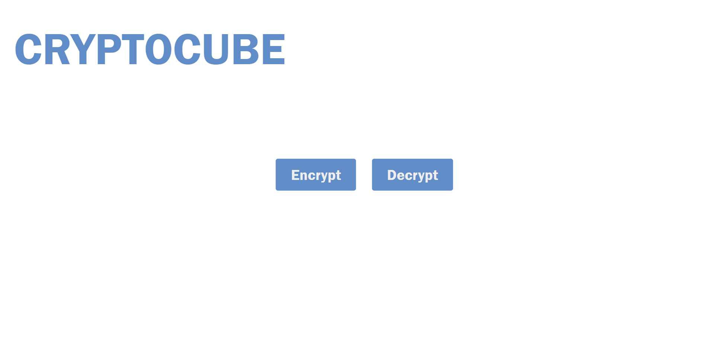
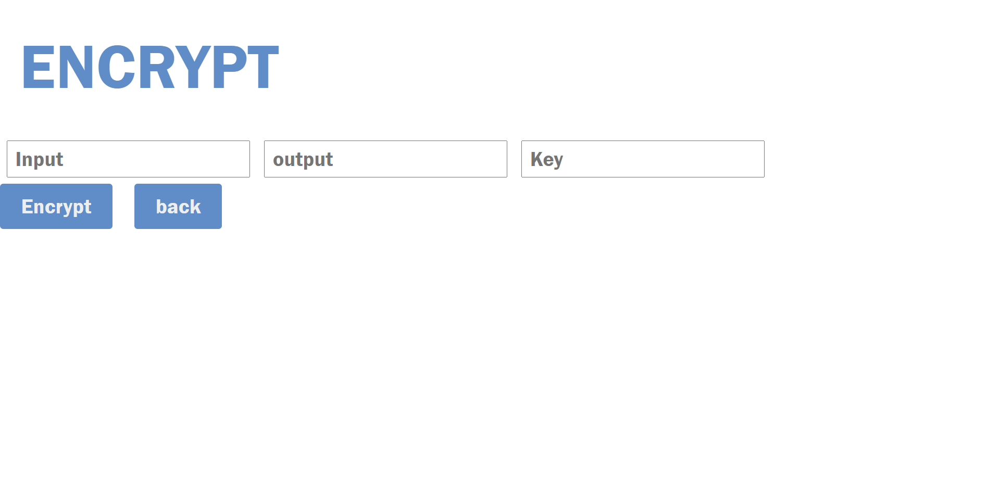
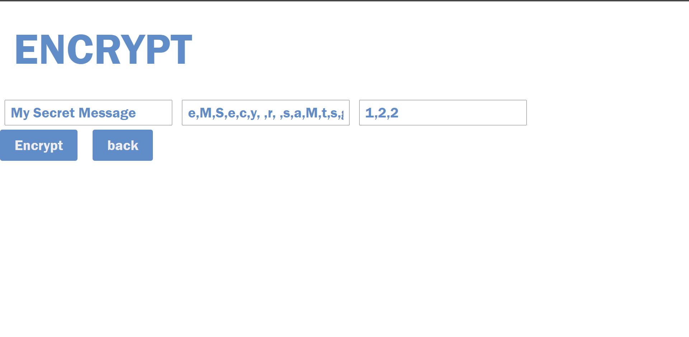
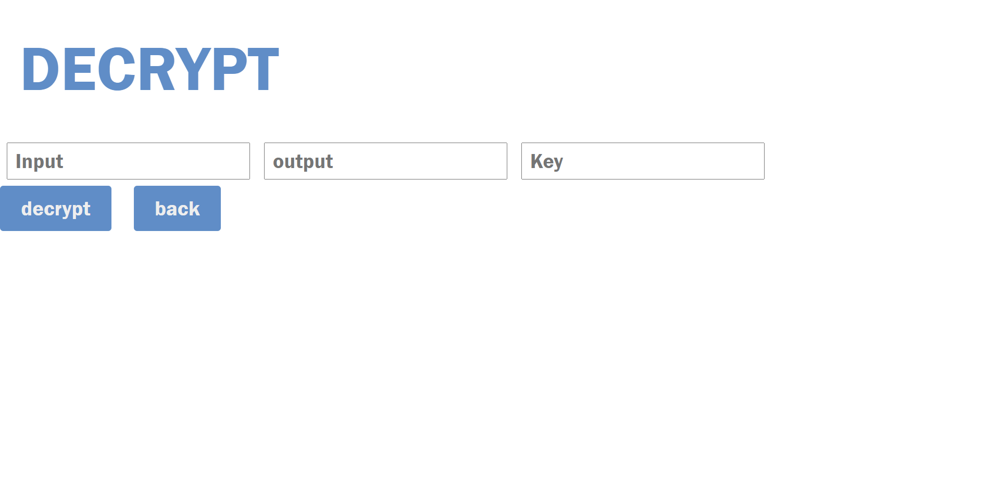
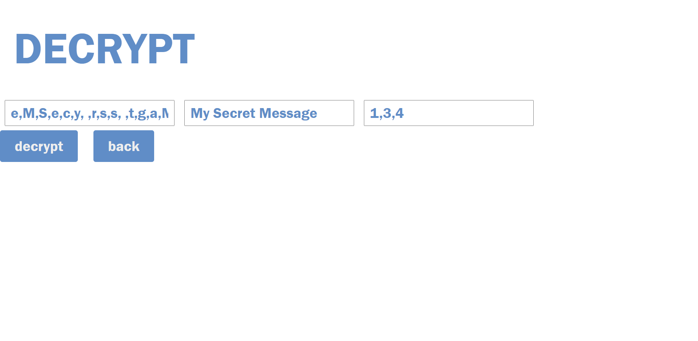

# 🧊 cryptoCube

## 🔄 Working 
This is a type of encryption in which every word in text is kept at the individual corner of the cubes and cubes are rotated in random order which generate encrypted text. we can also decrypt the encrypted text with the help of key generated while encryption.

## What it does 🔒
1. Encrypt(shuffle text) text and generate key
2. decrypt text based on key

## How to run 🏃‍♂️
Just open **index.html** file

## Preview
1. **Main Screen**

2. **Encryption Screen** 

3. **Encryption Example** 

4. **Dcryption Screen** 
 

4. **Dcryption Example** 
 
